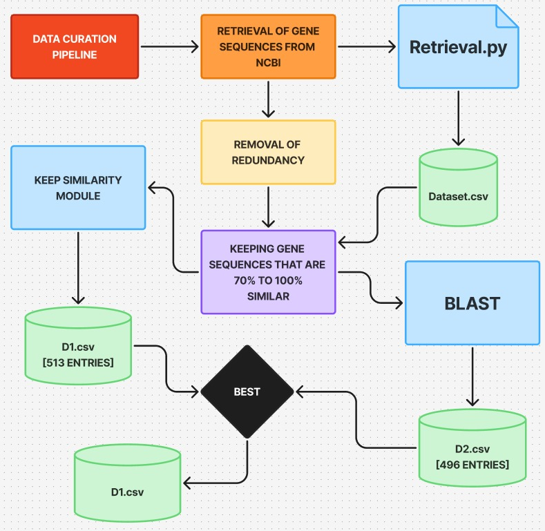

# 🧬 Network Analysis of Antibiotic Resistance Evolution Paths
### A Study of the *optrA* Gene Using BLAST and K-mer Similarity

> **Amrita Vishwa Vidyapeetam, Bengaluru**  
> Adina Sree Venkat Utham Kumar (BL.SC.U4AIE24102) · Saishree Sreekanth (BL.SC.U4AIE24140) · Avyuktha Y (BL.SC.U4AIE24107)

---

## 📌 Project Overview

This project models **antibiotic resistance evolution as a network graph**, focusing on the ***optrA*** gene — a transferable resistance gene that confers resistance to oxazolidinones and phenicols (last-resort antibiotics).

The core idea:
- 🔵 **Nodes** = distinct resistance states (unique *optrA* sequences)
- 🔗 **Edges** = mutational transitions between states
- 🧭 **Goal** = find shortest/least-advantageous evolutionary paths to identify **evolutionary dead ends**

---

## 🗂️ Project Structure

```
📦 optrA-network-analysis
 ┣ 📂 data
 ┃ ┣ 📄 output.xlsx                    # Raw NCBI dataset (2,385 sequences)
 ┃ ┣ 📄 output_500plus.xlsx            # Length-filtered dataset (1,286 sequences)
 ┃ ┣ 📄 optrA_deduplicated_strict.xlsx # K-mer filtered dataset (513 sequences)
 ┃ ┣ 📄 optrA_BLAST_filtered.xlsx      # BLAST filtered dataset (496 sequences)
 ┃ ┗ 📄 optrA_sequences.fasta          # FASTA file for BLAST input
 ┣ 📂 scripts
 ┃ ┣ 📄 excel_to_fasta.py              # Converts Excel dataset to FASTA format
 ┃ ┣ 📄 remove_similar_strict.py       # K-mer similarity filtering (70% threshold)
 ┃ ┣ 📄 parse_blast_updated.py         # Parses BLAST results and outputs Excel
 ┃ ┗ 📄 keep_similar.py                # Keeps sequences within similarity range
 ┣ 📄 README.md
 ┗ 📄 optrA_report_IEEE.tex            # Full IEEE format report (LaTeX)
```

---

## 🧫 About the *optrA* Gene

| Property | Detail |
|---|---|
| Gene name | *optrA* |
| Gene family | ABC-F protein |
| Full length | ~1,968 bp |
| Protein length | 655 amino acids |
| Resistance to | Oxazolidinones (linezolid), Phenicols (chloramphenicol) |
| Transfer mechanism | Conjugative plasmids / Integrative conjugative elements |
| First reported | Wang *et al.*, 2015 |
| Host organisms | *Enterococcus faecalis*, *Enterococcus faecium*, others |

---

## 📊 Dataset Metadata

All sequences were retrieved from the **NCBI Nucleotide Database** using the query:
```
optrA[gene]
```

| Filtering Stage | Sequences | Removed |
|---|---|---|
| Raw NCBI dataset | 2,385 | — |
| After length filter (> 500 bp) | 1,286 | 1,099 |
| After K-mer filtering (70%) | 513 | 773 |
| After BLAST filtering (70%) | 496 | 790 |

### Excel File Format
Each Excel file contains 3 columns:

| Column | Description |
|---|---|
| `Header` | NCBI accession ID, gene name, protein ID, genomic location |
| `Sequence` | Raw nucleotide sequence (A, T, G, C) |
| `Length (bp)` | Length of the sequence in base pairs |

---

## ⚙️ Pipeline




```
NCBI Nucleotide DB
       │
       ▼
Raw Dataset (2,385 sequences)
       │
       ▼
Length Filter > 500 bp
       │
       ▼
1,286 sequences
       │
       ├──────────────────────┐
       ▼                      ▼
K-mer Filtering (70%)   BLAST Filtering (70%)
       │                      │
       ▼                      ▼
  513 sequences          496 sequences
       │                      │
       └──────────┬───────────┘
                  ▼
        Network Construction
   (Nodes = Sequences, Edges = Similarity)
```

---

## 🛠️ Modules & Tools

| Module / Tool | Language | Purpose |
|---|---|---|
| `pandas` | Python | Reading/writing Excel files, data manipulation |
| `openpyxl` | Python | Creating formatted Excel output files |
| `difflib` | Python | Initial sequence similarity (SequenceMatcher) |
| Custom K-mer Jaccard | Python | Biologically meaningful similarity scoring |
| `BLAST+` (blastn) | Command Line | Gold-standard pairwise sequence alignment |
| `makeblastdb` | Command Line | Building local BLAST nucleotide database |
| NCBI Nucleotide DB | Web | Source of all *optrA* sequences |

---

## 🚀 How to Run

### Prerequisites
```bash
pip install pandas openpyxl
```
Also install [BLAST+](https://ftp.ncbi.nlm.nih.gov/blast/executables/blast+/LATEST/) for the BLAST pipeline.

### Step 1 — Convert Excel to FASTA
```bash
python scripts/excel_to_fasta.py
```

### Step 2 — Run K-mer Similarity Filtering
```bash
python scripts/remove_similar_strict.py
```
Output: `optrA_deduplicated_strict.xlsx` (513 sequences)

### Step 3 — Build BLAST Database
```bash
makeblastdb -in optrA_sequences.fasta -dbtype nucl -out optrA_db
```

### Step 4 — Run BLAST
```bash
blastn -query optrA_sequences.fasta -db optrA_db -out blast_results.txt -outfmt 6 -perc_identity 70
```

### Step 5 — Parse BLAST Results
```bash
python scripts/parse_blast_updated.py
```
Output: `optrA_BLAST_filtered.xlsx` (496 sequences)

---

## 📐 Similarity Methods Compared

| Property | K-mer Jaccard | BLAST |
|---|---|---|
| Threshold used | 70% | 70% |
| Sequences retained | **513** | **496** |
| Difference | 17 sequences (3.3%) | — |
| Method type | K-mer set comparison | Sequence alignment |
| Handles gaps/indels | ❌ | ✅ |
| Speed | Moderate | Fast |
| Biological accuracy | Moderate | High |
| Industry standard | ❌ | ✅ |

---

## 🔬 Intelligence Angle

This project applies **graph theory** and **path planning** concepts from AI to biology:

- **Graph theory** → model the mutation space as a directed graph
- **Shortest path algorithms** (e.g. Dijkstra's) → find most likely evolutionary trajectories
- **Evolutionary constraints** → identify dead ends where bacteria cannot develop further resistance
- **Optimal sequencing strategies** → exploit dead ends to design better antibiotic treatments

---

## 📚 References

1. Wang *et al.* (2015). *A novel gene, optrA, that confers transferable resistance to oxazolidinones and phenicols.* Journal of Antimicrobial Chemotherapy, 70(8), 2182–2190.
2. Altschul *et al.* (1990). *Basic local alignment search tool.* Journal of Molecular Biology, 215(3), 403–410.
3. Ondov *et al.* (2016). *Mash: fast genome and metagenome distance estimation using MinHash.* Genome Biology, 17, 132.
4. WHO (2017). *Global priority list of antibiotic-resistant bacteria.*

---

## 📝 License
This project was developed for academic purposes at Amrita Vishwa Vidyapeetam, Bengaluru.
